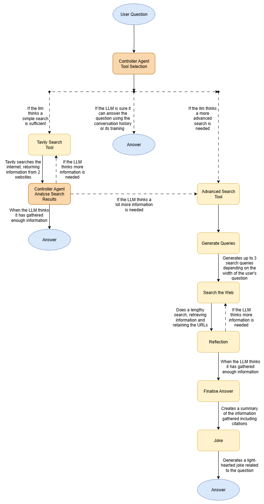

# Agentic-AI-Search
***
This project incorporates Google Deepmind's example advanced search agent within a controller agent to remember previous questions, cut token use, and showcase 2 different versions of RAG using LangGraph.

## Mermaid Diagram
 <br>

Google Gemini's advanced search agent (www.github.com/google-gemini/gemini-fullstack-langgraph-quickstart) was built by Google's Deepmind team to do extensive research on a single topic using node-based RAG to ensure that the user's question is answered.  I added an additional joke node to the agent, and then packaged the agent as a tool for a controller agent to use, only when it believes its use is preferable.

The controller agent fits the tech to the context, choosing whether or not an internet search is needed, and if it is, deciding what search tool to use.  When the controller agent analyses results from Tavily, it completes the jobs of both the Reflection and Finalise Answer nodes (from the advanced search tool), reflecting the smaller amount of information it has to analyse, and saving tokens.

In the first version of RAG, the controller agent has the option to use tools to retrieve information, but in the second, (Google Deepmind's agent), the web search is not inside a tool node, but a node in and of itself, and the workflow must use it.

The controller agent also has access to the conversation history, which is stored in an SQL databse, allowing for the agent to use context within its answers.

# Installation
```
git clone www.github.com/Samuel-Kelly-hub/Agentic-AI-Search
cd Agentic-AI-Search
pip install -r requirements.txt
```
# How to Run Notebooks
In order to run the Notebooks, you must have an API key for both Google Gemini and Tavily Search and for the keys to be in your environment as GEMINI_API_KEY and TAVILY_API_KEY
